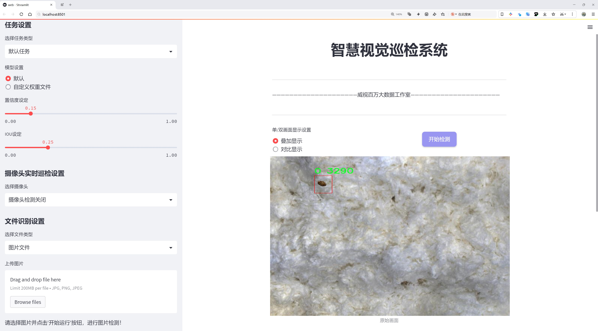
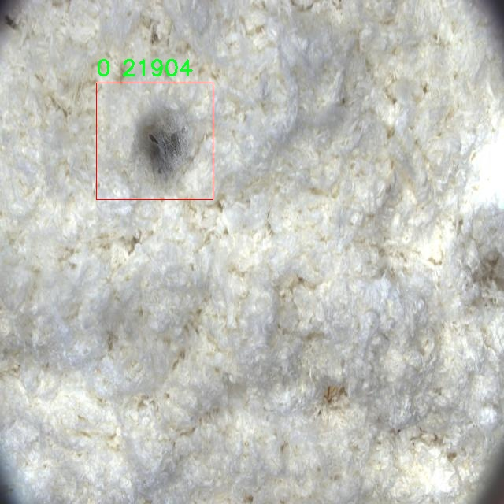

# 光纤缺陷检测检测系统源码分享
 # [一条龙教学YOLOV8标注好的数据集一键训练_70+全套改进创新点发刊_Web前端展示]

### 1.研究背景与意义

项目参考[AAAI Association for the Advancement of Artificial Intelligence](https://gitee.com/qunmasj/projects)

项目来源[AACV Association for the Advancement of Computer Vision](https://kdocs.cn/l/cszuIiCKVNis)

研究背景与意义

随着光纤通信技术的迅猛发展，光纤作为信息传输的主要媒介，其质量的优劣直接影响到通信系统的性能和稳定性。光纤在生产、运输和安装过程中，可能会出现各种缺陷，如划痕、气泡、折弯等，这些缺陷不仅会导致信号衰减，还可能引发更严重的通信故障。因此，开发一种高效、准确的光纤缺陷检测系统显得尤为重要。传统的光纤缺陷检测方法多依赖人工目视检查或简单的机器视觉技术，这些方法不仅耗时耗力，而且容易受到人为因素的影响，导致检测结果的不准确性。

近年来，深度学习技术的迅猛发展为图像处理和目标检测领域带来了新的机遇。YOLO（You Only Look Once）系列算法以其高效的实时检测能力和较高的准确率，逐渐成为目标检测的主流方法。特别是YOLOv8的推出，进一步提升了检测精度和速度，使其在各种应用场景中表现出色。然而，针对光纤缺陷检测的特定需求，现有的YOLOv8模型仍需进行一定的改进和优化，以适应光纤缺陷的特殊特征和检测要求。

本研究基于改进YOLOv8算法，构建一个光纤缺陷检测系统，旨在实现对光纤缺陷的自动化、智能化检测。为此，我们利用了一个包含1998张图像的数据集，该数据集专注于光纤缺陷的目标检测，涵盖了多种光纤缺陷类型。尽管该数据集目前仅包含一个类别，但其丰富的图像样本为模型的训练和验证提供了坚实的基础。通过对数据集的深入分析和处理，我们可以提取出光纤缺陷的特征信息，从而为改进YOLOv8模型提供必要的支持。

本研究的意义不仅在于提高光纤缺陷检测的准确性和效率，更在于推动光纤检测技术的智能化进程。通过引入深度学习技术，我们能够实现对光纤缺陷的快速、准确检测，减少人工干预，提高检测的可靠性。此外，改进后的YOLOv8模型还可以为其他领域的目标检测提供借鉴，具有广泛的应用前景。

综上所述，基于改进YOLOv8的光纤缺陷检测系统的研究，不仅具有重要的理论价值，还有着显著的实际应用意义。随着光纤通信技术的不断进步，未来对光纤质量的要求将愈加严格，因此，建立高效的光纤缺陷检测系统，将为保障光纤通信的稳定性和可靠性提供重要支持。

### 2.图片演示




##### 注意：由于此博客编辑较早，上面“2.图片演示”和“3.视频演示”展示的系统图片或者视频可能为老版本，新版本在老版本的基础上升级如下：（实际效果以升级的新版本为准）

  （1）适配了YOLOV8的“目标检测”模型和“实例分割”模型，通过加载相应的权重（.pt）文件即可自适应加载模型。

  （2）支持“图片识别”、“视频识别”、“摄像头实时识别”三种识别模式。

  （3）支持“图片识别”、“视频识别”、“摄像头实时识别”三种识别结果保存导出，解决手动导出（容易卡顿出现爆内存）存在的问题，识别完自动保存结果并导出到tempDir中。

  （4）支持Web前端系统中的标题、背景图等自定义修改，后面提供修改教程。

  另外本项目提供训练的数据集和训练教程,暂不提供权重文件（best.pt）,需要您按照教程进行训练后实现图片演示和Web前端界面演示的效果。

### 3.视频演示

[3.1 视频演示](https://www.bilibili.com/video/BV1wzt6e2E5r/)

### 4.数据集信息展示

##### 4.1 本项目数据集详细数据（类别数＆类别名）

nc: 1
names: ['0']


##### 4.2 本项目数据集信息介绍

数据集信息展示

在光纤缺陷检测领域，数据集的构建与选择至关重要。为实现对光纤缺陷的高效识别与分类，本研究采用了名为“New Fiber Model”的数据集。该数据集专门为改进YOLOv8模型在光纤缺陷检测任务中的表现而设计，旨在提升模型的准确性和鲁棒性。

“New Fiber Model”数据集的独特之处在于其专注于光纤缺陷这一特定类别，数据集的类别数量为1，且该类别被标记为“0”。这一设计简化了模型的训练过程，使得研究者能够专注于光纤缺陷的特征提取与学习。尽管类别数量较少，但数据集中的样本量及其多样性为模型的训练提供了充足的基础。数据集包含了多种光纤缺陷的图像样本，这些样本涵盖了不同类型的缺陷，如断裂、划痕、气泡等，确保了模型能够在多种情况下进行有效的检测。

在数据集的构建过程中，研究团队采用了高精度的图像采集技术，确保了图像的清晰度和细节的完整性。每一张图像都经过精心标注，标注信息不仅包括缺陷的存在与否，还涵盖了缺陷的具体位置和类型。这种详尽的标注方式为YOLOv8模型的训练提供了必要的监督信息，使得模型能够学习到光纤缺陷的特征，从而提高其检测能力。

为了增强模型的泛化能力，数据集还进行了多样化处理，包括对图像进行旋转、缩放、翻转等操作。这些数据增强技术使得模型在面对不同环境和条件下的光纤图像时，依然能够保持较高的检测精度。此外，数据集的构建还考虑到了不同光照条件和背景复杂度的影响，确保模型在实际应用中能够适应各种场景。

在数据集的使用过程中，研究者将其划分为训练集、验证集和测试集，以便于对模型的性能进行全面评估。训练集用于模型的学习，验证集用于调优模型参数，而测试集则用于最终的性能评估。这种划分方式不仅能够有效防止模型的过拟合，还能确保模型在未见数据上的表现具有可靠性。

综上所述，“New Fiber Model”数据集为改进YOLOv8的光纤缺陷检测系统提供了坚实的基础。通过高质量的图像样本、详尽的标注信息以及有效的数据增强策略，该数据集不仅提升了模型的训练效果，也为后续的研究与应用奠定了良好的基础。随着光纤技术的不断发展，准确、高效的光纤缺陷检测将对通信行业的安全与稳定运行产生深远的影响，而“New Fiber Model”数据集正是实现这一目标的重要工具。





### 5.全套项目环境部署视频教程（零基础手把手教学）

[5.1 环境部署教程链接（零基础手把手教学）](https://www.ixigua.com/7404473917358506534?logTag=c807d0cbc21c0ef59de5)


[5.2 安装Python虚拟环境创建和依赖库安装视频教程链接（零基础手把手教学）](https://www.ixigua.com/7404474678003106304?logTag=1f1041108cd1f708b01a)

### 6.手把手YOLOV8训练视频教程（零基础小白有手就能学会）

[6.1 手把手YOLOV8训练视频教程（零基础小白有手就能学会）](https://www.ixigua.com/7404477157818401292?logTag=d31a2dfd1983c9668658)

### 7.70+种全套YOLOV8创新点代码加载调参视频教程（一键加载写好的改进模型的配置文件）

[7.1 70+种全套YOLOV8创新点代码加载调参视频教程（一键加载写好的改进模型的配置文件）](https://www.ixigua.com/7404478314661806627?logTag=29066f8288e3f4eea3a4)

### 8.70+种全套YOLOV8创新点原理讲解（非科班也可以轻松写刊发刊，V10版本正在科研待更新）

由于篇幅限制，每个创新点的具体原理讲解就不一一展开，具体见下列网址中的创新点对应子项目的技术原理博客网址【Blog】：


[8.1 70+种全套YOLOV8创新点原理讲解链接](https://gitee.com/qunmasj/good)

### 9.系统功能展示（检测对象为举例，实际内容以本项目数据集为准）

图9.1.系统支持检测结果表格显示

  图9.2.系统支持置信度和IOU阈值手动调节

  图9.3.系统支持自定义加载权重文件best.pt(需要你通过步骤5中训练获得)

  图9.4.系统支持摄像头实时识别

  图9.5.系统支持图片识别

  图9.6.系统支持视频识别

  图9.7.系统支持识别结果文件自动保存

  图9.8.系统支持Excel导出检测结果数据


### 10.原始YOLOV8算法原理

原始YOLOv8算法原理

YOLOv8作为YOLO系列中的最新版本，代表了目标检测领域的一次重要进步。相较于前代的YOLOv5，YOLOv8在检测精度和速度上均有显著提升，体现了深度学习模型在特征提取和处理能力上的不断演进。YOLOv8的设计理念不仅仅是对前一版本的简单迭代，而是结合了近年来在计算机视觉领域的多项创新，形成了一个更加高效、灵活且强大的目标检测框架。

YOLOv8的网络结构可以分为四个主要部分：输入端、骨干网络、颈部网络和头部网络。输入端负责对输入图像进行预处理，包括马赛克数据增强、自适应锚框计算和自适应灰度填充等。这些技术的引入旨在提升模型的鲁棒性和泛化能力，使其能够在不同的环境和条件下保持良好的性能。特别是马赛克数据增强，通过将多张图像拼接在一起，增加了训练数据的多样性，从而帮助模型更好地学习到目标的特征。

在骨干网络部分，YOLOv8采用了Conv.C2f和SPPF（Spatial Pyramid Pooling Fusion）结构。C2f模块的设计灵感来源于YOLOv7的ELAN结构，利用更多的分支跨层连接，增强了模型的梯度流动性。这种设计使得网络能够更有效地学习到复杂的特征表示，进而提升目标检测的准确性。SPPF模块则通过空间金字塔池化的方式，进一步增强了对不同尺度目标的感知能力，使得YOLOv8在处理多尺度目标时表现得更加出色。

颈部网络采用了路径聚合网络（PAN）结构，旨在加强不同缩放尺度对象的特征融合能力。PAN通过上下采样和特征拼接的方式，有效地整合了来自不同层次的特征信息，使得模型在处理复杂场景时能够更好地捕捉到目标的细节。这种特征融合策略在YOLOv8中得到了充分的应用，确保了模型在面对多样化的目标时依然能够保持高效的检测性能。

头部网络则是YOLOv8的一大创新之处。与之前的YOLO版本不同，YOLOv8将分类和检测过程进行了有效的解耦，采用了主流的解耦头结构。这一结构的引入，使得分类任务和定位任务可以并行进行，分别提取类别和位置特征，从而提高了模型的收敛速度和预测精度。此外，YOLOv8摒弃了传统的锚框检测方法，转而采用无锚框的检测策略，直接预测目标的中心位置。这一变化不仅减少了锚框预测的数量，还加速了非最大抑制（NMS）过程，提高了整体的检测效率。

在损失计算方面，YOLOv8引入了Task-Aligned Assigner方法，根据分类与回归的分数加权结果选择正样本。损失计算涵盖了分类和回归两个分支，其中分类分支采用了二元交叉熵损失（Binary Cross-Entropy Loss），而回归分支则结合了分布焦点损失（Distribution Focal Loss）和完全交并比损失（Complete Intersection over Union Loss），以提升模型对边界框预测的精准性。这种多样化的损失计算策略，使得YOLOv8在训练过程中能够更好地平衡分类和定位的需求，从而实现更高的检测精度。

YOLOv8的改进不仅体现在网络结构的优化上，还包括对模型轻量化的追求。通过调整不同尺度模型的通道数，YOLOv8实现了在保持高精度的同时，显著降低了模型的参数量和计算复杂度。这一特性使得YOLOv8特别适合在资源受限的环境中应用，如移动设备和嵌入式系统，极大地拓宽了其应用场景。

尽管YOLOv8在多方面取得了显著的进步，但在复杂的水面环境下，仍然存在小目标漂浮物检测的挑战。由于小目标的特征复杂且背景多样，YOLOv8在这些特定场景下可能会出现定位误差和对目标感知能力不足的问题。因此，针对这些不足，研究者们提出了YOLOv8-WSSOD算法，通过引入BiFormer双层路由注意力机制和更小的检测头，进一步提升了网络对小目标的感知能力，并在颈部网络中引入GSConv和Slim-neck技术，以保持精度并降低计算量。

综上所述，YOLOv8作为YOLO系列的最新代表，通过一系列创新的网络结构和优化策略，成功实现了目标检测精度和速度的双重提升。其在处理多尺度目标、特征融合以及损失计算等方面的改进，使得YOLOv8在复杂环境下的应用潜力得到了极大的扩展。未来，随着更多研究的深入，YOLOv8及其衍生版本有望在更广泛的实际应用中发挥重要作用。


### 11.项目核心源码讲解（再也不用担心看不懂代码逻辑）

#### 11.1 code\ultralytics\utils\callbacks\hub.py

以下是对代码的核心部分进行提炼和详细注释的结果：

```python
# 导入必要的库
import json
from time import time
from ultralytics.hub.utils import HUB_WEB_ROOT, PREFIX, events
from ultralytics.utils import LOGGER, SETTINGS

def on_fit_epoch_end(trainer):
    """在每个训练周期结束时上传训练进度指标。"""
    session = getattr(trainer, "hub_session", None)  # 获取训练器的会话对象
    if session:
        # 收集训练损失和其他指标
        all_plots = {
            **trainer.label_loss_items(trainer.tloss, prefix="train"),  # 获取训练损失
            **trainer.metrics,  # 获取其他指标
        }
        # 如果是第一个周期，添加模型信息
        if trainer.epoch == 0:
            from ultralytics.utils.torch_utils import model_info_for_loggers
            all_plots = {**all_plots, **model_info_for_loggers(trainer)}  # 添加模型信息

        # 将指标数据转换为JSON格式并存入会话的指标队列
        session.metrics_queue[trainer.epoch] = json.dumps(all_plots)
        # 检查是否超过上传速率限制
        if time() - session.timers["metrics"] > session.rate_limits["metrics"]:
            session.upload_metrics()  # 上传指标
            session.timers["metrics"] = time()  # 重置计时器
            session.metrics_queue = {}  # 重置指标队列

def on_model_save(trainer):
    """在模型保存时上传检查点，遵循速率限制。"""
    session = getattr(trainer, "hub_session", None)  # 获取训练器的会话对象
    if session:
        is_best = trainer.best_fitness == trainer.fitness  # 判断当前模型是否是最佳模型
        # 检查是否超过上传速率限制
        if time() - session.timers["ckpt"] > session.rate_limits["ckpt"]:
            LOGGER.info(f"{PREFIX}Uploading checkpoint {HUB_WEB_ROOT}/models/{session.model_file}")  # 日志输出
            session.upload_model(trainer.epoch, trainer.last, is_best)  # 上传模型
            session.timers["ckpt"] = time()  # 重置计时器

def on_train_end(trainer):
    """在训练结束时上传最终模型和指标到Ultralytics HUB。"""
    session = getattr(trainer, "hub_session", None)  # 获取训练器的会话对象
    if session:
        LOGGER.info(f"{PREFIX}Syncing final model...")  # 日志输出
        # 上传最终模型和指标
        session.upload_model(
            trainer.epoch,
            trainer.best,
            map=trainer.metrics.get("metrics/mAP50-95(B)", 0),  # 获取mAP指标
            final=True,  # 标记为最终模型
        )
        session.alive = False  # 停止心跳
        LOGGER.info(f"{PREFIX}Done ✅\n" f"{PREFIX}View model at {session.model_url} 🚀")  # 日志输出

# 定义回调函数
callbacks = (
    {
        "on_fit_epoch_end": on_fit_epoch_end,  # 训练周期结束时的回调
        "on_model_save": on_model_save,  # 模型保存时的回调
        "on_train_end": on_train_end,  # 训练结束时的回调
    }
    if SETTINGS["hub"] is True  # 如果启用了hub设置
    else {}
)  # 验证是否启用
```

### 代码分析与注释

1. **导入模块**：导入了处理JSON数据和时间的库，以及Ultralytics库中的一些工具。

2. **on_fit_epoch_end**：这个函数在每个训练周期结束时被调用，主要负责收集训练损失和其他指标，并将其上传到Ultralytics HUB。它还会检查上传的速率限制，以确保不会超过规定的频率。

3. **on_model_save**：在模型保存时调用，负责上传模型检查点。它会判断当前模型是否是最佳模型，并根据速率限制进行上传。

4. **on_train_end**：在训练结束时调用，负责上传最终的模型和训练指标到Ultralytics HUB，并停止心跳。

5. **callbacks**：定义了一个回调字典，根据设置决定是否启用这些回调函数。这个字典包含了训练周期结束、模型保存和训练结束时的回调函数。

以上是对代码的核心部分和详细注释，希望能帮助你理解其功能和实现。

这个文件是一个用于Ultralytics YOLO框架的回调函数模块，主要用于在训练、验证和导出过程中与Ultralytics HUB进行交互。文件中包含了一系列的回调函数，这些函数在特定事件发生时被调用，以便记录训练进度、上传模型和指标等。

首先，文件导入了一些必要的模块，包括`json`和`time`，以及Ultralytics HUB和其他工具的相关功能。接着，定义了一些回调函数。

`on_pretrain_routine_end`函数在预训练例程结束时被调用，主要用于记录信息并启动上传速率限制的计时器。它检查训练器是否有与HUB会话相关的属性，如果有，则初始化两个计时器，用于控制上传指标和检查点的频率。

`on_fit_epoch_end`函数在每个训练周期结束时被调用，负责上传训练进度的指标。它从训练器中获取当前的损失和指标，并将其存储在会话的指标队列中。如果当前时间与上次上传指标的时间间隔超过了设定的速率限制，则调用上传函数并重置计时器和队列。

`on_model_save`函数在模型保存时被调用，主要用于将检查点上传到Ultralytics HUB，并控制上传的频率。它会检查当前的最佳适应度是否与训练器的适应度相同，并在符合条件时上传模型。

`on_train_end`函数在训练结束时被调用，负责上传最终模型和指标到Ultralytics HUB。它会记录上传过程，并在完成后停止心跳信号。

`on_train_start`、`on_val_start`、`on_predict_start`和`on_export_start`函数分别在训练、验证、预测和导出开始时被调用，主要用于执行与这些事件相关的操作。

最后，所有的回调函数被组织成一个字典，只有在设置中启用了HUB功能时，这些回调函数才会被注册。这个设计使得代码具有灵活性，可以根据需要启用或禁用HUB相关的功能。整体来看，这个模块的主要目的是为了在训练过程中与Ultralytics HUB进行有效的交互，以便更好地管理模型和训练数据。

#### 11.2 ui.py

以下是代码中最核心的部分，并附上详细的中文注释：

```python
import sys
import subprocess

def run_script(script_path):
    """
    使用当前 Python 环境运行指定的脚本。

    Args:
        script_path (str): 要运行的脚本路径

    Returns:
        None
    """
    # 获取当前 Python 解释器的路径
    python_path = sys.executable

    # 构建运行命令，使用 streamlit 运行指定的脚本
    command = f'"{python_path}" -m streamlit run "{script_path}"'

    # 执行命令，并等待其完成
    result = subprocess.run(command, shell=True)
    
    # 检查命令执行的返回码，如果不为0，表示执行出错
    if result.returncode != 0:
        print("脚本运行出错。")

# 实例化并运行应用
if __name__ == "__main__":
    # 指定要运行的脚本路径
    script_path = "web.py"  # 假设脚本在当前目录下

    # 调用函数运行指定的脚本
    run_script(script_path)
```

### 代码注释说明：
1. **导入模块**：
   - `sys`：用于访问与 Python 解释器紧密相关的变量和函数。
   - `subprocess`：用于执行外部命令和与其交互。

2. **`run_script` 函数**：
   - 该函数接受一个脚本路径作为参数，并使用当前 Python 环境运行该脚本。
   - 使用 `sys.executable` 获取当前 Python 解释器的路径，以确保使用正确的 Python 版本。
   - 构建命令字符串，使用 `streamlit` 模块运行指定的脚本。
   - 使用 `subprocess.run` 执行命令，并等待其完成。
   - 检查命令的返回码，如果返回码不为0，表示脚本运行出错，并打印错误信息。

3. **主程序部分**：
   - 使用 `if __name__ == "__main__":` 确保该代码块仅在直接运行脚本时执行。
   - 指定要运行的脚本路径（在这里假设为 "web.py"）。
   - 调用 `run_script` 函数，传入脚本路径以执行该脚本。

这个程序文件的主要功能是通过当前的 Python 环境来运行一个指定的脚本，具体是使用 Streamlit 框架来启动一个 Web 应用。程序首先导入了必要的模块，包括 `sys`、`os` 和 `subprocess`，这些模块分别用于获取系统信息、操作文件系统和执行外部命令。

在 `run_script` 函数中，首先定义了一个参数 `script_path`，用于接收要运行的脚本的路径。函数内部通过 `sys.executable` 获取当前 Python 解释器的路径，这样可以确保使用正确的 Python 环境来执行脚本。接着，构建了一个命令字符串，该命令用于调用 Streamlit 运行指定的脚本。

使用 `subprocess.run` 方法执行构建好的命令，如果命令执行后返回的状态码不为零，表示脚本运行出错，程序会打印出错误信息。

在文件的最后部分，使用 `if __name__ == "__main__":` 来确保当这个文件作为主程序运行时，下面的代码才会被执行。这里指定了要运行的脚本路径为 `web.py`，并调用 `run_script` 函数来启动这个脚本。

总的来说，这个程序文件的作用是简化了使用 Streamlit 启动 Web 应用的过程，通过封装成函数的方式，使得用户只需提供脚本路径即可轻松运行相应的应用。

#### 11.3 code\ultralytics\models\yolo\model.py

```python
# 导入必要的模块和类
from ultralytics.engine.model import Model
from ultralytics.models import yolo
from ultralytics.nn.tasks import ClassificationModel, DetectionModel, OBBModel, PoseModel, SegmentationModel

class YOLO(Model):
    """YOLO (You Only Look Once) 目标检测模型类。"""

    @property
    def task_map(self):
        """将任务类型映射到相应的模型、训练器、验证器和预测器类。"""
        return {
            "classify": {  # 分类任务
                "model": ClassificationModel,  # 使用的模型类
                "trainer": yolo.classify.ClassificationTrainer,  # 训练器类
                "validator": yolo.classify.ClassificationValidator,  # 验证器类
                "predictor": yolo.classify.ClassificationPredictor,  # 预测器类
            },
            "detect": {  # 检测任务
                "model": DetectionModel,  # 使用的模型类
                "trainer": yolo.detect.DetectionTrainer,  # 训练器类
                "validator": yolo.detect.DetectionValidator,  # 验证器类
                "predictor": yolo.detect.DetectionPredictor,  # 预测器类
            },
            "segment": {  # 分割任务
                "model": SegmentationModel,  # 使用的模型类
                "trainer": yolo.segment.SegmentationTrainer,  # 训练器类
                "validator": yolo.segment.SegmentationValidator,  # 验证器类
                "predictor": yolo.segment.SegmentationPredictor,  # 预测器类
            },
            "pose": {  # 姿态估计任务
                "model": PoseModel,  # 使用的模型类
                "trainer": yolo.pose.PoseTrainer,  # 训练器类
                "validator": yolo.pose.PoseValidator,  # 验证器类
                "predictor": yolo.pose.PosePredictor,  # 预测器类
            },
            "obb": {  # 方向边界框任务
                "model": OBBModel,  # 使用的模型类
                "trainer": yolo.obb.OBBTrainer,  # 训练器类
                "validator": yolo.obb.OBBValidator,  # 验证器类
                "predictor": yolo.obb.OBBPredictor,  # 预测器类
            },
        }
```

### 代码核心部分说明：
1. **导入模块**：导入了必要的类和模块，以便后续使用。
2. **YOLO类**：定义了一个YOLO类，继承自Model类，表示YOLO目标检测模型。
3. **task_map属性**：该属性返回一个字典，映射不同的任务类型（如分类、检测、分割、姿态估计和方向边界框）到相应的模型、训练器、验证器和预测器类。这使得在使用YOLO模型时，可以根据具体任务选择合适的组件。

这个程序文件定义了一个名为 `YOLO` 的类，继承自 `Model` 类，主要用于实现 YOLO（You Only Look Once）目标检测模型。文件中首先导入了一些必要的模块和类，包括 `Model` 类和与 YOLO 相关的分类、检测、分割、姿态估计和有向边界框（OBB）模型。

在 `YOLO` 类中，定义了一个名为 `task_map` 的属性，这个属性返回一个字典，字典的键是不同的任务类型（如分类、检测、分割、姿态估计和 OBB），每个键对应的值又是一个字典，包含了与该任务相关的模型、训练器、验证器和预测器类。

具体来说，对于每种任务类型，`task_map` 中都定义了以下内容：
- `model`：对应的模型类，例如分类任务对应 `ClassificationModel`，检测任务对应 `DetectionModel` 等。
- `trainer`：用于训练模型的类，例如分类任务的训练器是 `ClassificationTrainer`，检测任务的训练器是 `DetectionTrainer` 等。
- `validator`：用于验证模型性能的类，例如分类任务的验证器是 `ClassificationValidator`，检测任务的验证器是 `DetectionValidator` 等。
- `predictor`：用于进行预测的类，例如分类任务的预测器是 `ClassificationPredictor`，检测任务的预测器是 `DetectionPredictor` 等。

通过这种方式，`YOLO` 类能够根据不同的任务类型，灵活地选择相应的模型和处理流程，使得该类在处理各种计算机视觉任务时更加高效和模块化。整体上，这段代码为 YOLO 模型的多任务处理提供了结构化的支持。

#### 11.4 70+种YOLOv8算法改进源码大全和调试加载训练教程（非必要）\ultralytics\nn\modules\__init__.py

以下是保留的核心代码部分，并附上详细的中文注释：

```python
# 导入所需的模块
from .block import *  # 导入自定义的块模块
from .conv import *   # 导入卷积层模块
from .head import *   # 导入模型头部模块
from .transformer import *  # 导入变换器模块
```

### 代码注释说明：

1. **模块导入**：
   - `from .block import *`：导入当前包中的 `block` 模块，该模块可能包含一些基础构建块（如神经网络中的层或操作）。
   - `from .conv import *`：导入当前包中的 `conv` 模块，通常用于定义卷积层，这在卷积神经网络中是非常核心的部分。
   - `from .head import *`：导入当前包中的 `head` 模块，通常用于定义模型的输出层或头部，负责将特征图转换为最终的预测结果。
   - `from .transformer import *`：导入当前包中的 `transformer` 模块，可能用于实现变换器架构，适用于处理序列数据或图像数据的特征提取。

这些模块的导入为构建深度学习模型提供了必要的组件，确保模型能够进行有效的特征提取和预测。

该程序文件是Ultralytics YOLO（You Only Look Once）系列算法的一部分，主要用于定义和导入与YOLO模型相关的模块。文件的开头包含了版权信息，表明该代码遵循AGPL-3.0许可证。

文件中有一个文档字符串，提供了一个示例，说明如何使用这些模块。示例代码首先从`ultralytics.nn.modules`导入所有模块，然后使用PyTorch库创建一个张量`x`，这个张量的形状为(1, 128, 40, 40)，表示一个批次中有一个128通道的40x40的特征图。接着，代码实例化了一个卷积层`Conv`，输入和输出通道均为128。

示例中还展示了如何将这个卷积层导出为ONNX格式的模型文件。使用`torch.onnx.export`函数将模型`m`和输入张量`x`导出为一个名为`f`的ONNX文件。最后，使用操作系统命令行工具`onnxsim`对导出的ONNX模型进行简化，并尝试打开该文件。

在文件的最后，使用了相对导入的方式导入了多个模块，包括`block`、`conv`、`head`和`transformer`。这些模块可能包含了YOLO模型中不同的组件和功能，支持模型的构建和训练。

总的来说，该文件的主要功能是提供YOLO模型所需的基础模块，并展示了如何使用这些模块进行模型的可视化和导出。

#### 11.5 70+种YOLOv8算法改进源码大全和调试加载训练教程（非必要）\ultralytics\engine\predictor.py

以下是代码中最核心的部分，并附上详细的中文注释：

```python
class BasePredictor:
    """
    BasePredictor类用于创建预测器的基类。
    属性:
        args (SimpleNamespace): 预测器的配置。
        save_dir (Path): 保存结果的目录。
        model (nn.Module): 用于预测的模型。
        device (torch.device): 用于预测的设备。
        dataset (Dataset): 用于预测的数据集。
    """

    def __init__(self, cfg=DEFAULT_CFG, overrides=None, _callbacks=None):
        """
        初始化BasePredictor类。

        参数:
            cfg (str, optional): 配置文件的路径，默认为DEFAULT_CFG。
            overrides (dict, optional): 配置覆盖，默认为None。
        """
        self.args = get_cfg(cfg, overrides)  # 获取配置
        self.save_dir = get_save_dir(self.args)  # 获取保存目录
        self.done_warmup = False  # 是否完成预热
        self.model = None  # 模型初始化为None
        self.device = None  # 设备初始化为None
        self.dataset = None  # 数据集初始化为None
        self.callbacks = _callbacks or callbacks.get_default_callbacks()  # 初始化回调函数

    def preprocess(self, im):
        """
        在推理之前准备输入图像。

        参数:
            im (torch.Tensor | List(np.ndarray)): 输入图像，可以是张量或图像列表。
        """
        not_tensor = not isinstance(im, torch.Tensor)  # 检查输入是否为张量
        if not_tensor:
            im = np.stack(self.pre_transform(im))  # 预处理图像
            im = im[..., ::-1].transpose((0, 3, 1, 2))  # BGR转RGB，维度转换
            im = np.ascontiguousarray(im)  # 确保数组是连续的
            im = torch.from_numpy(im)  # 转换为张量

        im = im.to(self.device)  # 将图像移动到指定设备
        im = im.half() if self.model.fp16 else im.float()  # 转换数据类型
        if not_tensor:
            im /= 255  # 将像素值归一化到0.0 - 1.0
        return im

    def inference(self, im, *args, **kwargs):
        """对给定图像进行推理。"""
        return self.model(im, augment=self.args.augment)  # 使用模型进行推理

    def stream_inference(self, source=None, model=None, *args, **kwargs):
        """实时推理摄像头输入并将结果保存到文件。"""
        if not self.model:
            self.setup_model(model)  # 设置模型

        self.setup_source(source if source is not None else self.args.source)  # 设置数据源

        for batch in self.dataset:  # 遍历数据集
            path, im0s, vid_cap, s = batch  # 获取批次数据
            im = self.preprocess(im0s)  # 预处理图像
            preds = self.inference(im, *args, **kwargs)  # 进行推理
            self.results = self.postprocess(preds, im, im0s)  # 后处理结果

            for i in range(len(im0s)):
                self.write_results(i, self.results, (path[i], im, im0s[i]))  # 写入结果

            yield from self.results  # 生成结果

    def setup_model(self, model, verbose=True):
        """初始化YOLO模型并设置为评估模式。"""
        self.model = AutoBackend(model or self.args.model, device=select_device(self.args.device))  # 初始化模型
        self.device = self.model.device  # 更新设备
        self.model.eval()  # 设置模型为评估模式

    def write_results(self, idx, results, batch):
        """将推理结果写入文件或目录。"""
        p, im, _ = batch  # 获取批次数据
        result = results[idx]  # 获取当前结果
        # 处理保存逻辑
        if self.args.save_txt:
            result.save_txt(f'{self.save_dir}/labels/{p.stem}.txt')  # 保存文本结果
        # 其他保存逻辑...
```

### 代码说明：
1. **BasePredictor类**：这是一个基类，用于处理YOLO模型的推理过程。它包含了初始化、预处理、推理、后处理和结果写入等功能。
2. **__init__方法**：初始化类的属性，包括配置、保存目录、模型和设备等。
3. **preprocess方法**：对输入图像进行预处理，包括格式转换和归一化。
4. **inference方法**：使用模型对预处理后的图像进行推理。
5. **stream_inference方法**：实时处理输入源（如摄像头），进行推理并返回结果。
6. **setup_model方法**：初始化YOLO模型并设置为评估模式。
7. **write_results方法**：将推理结果保存到指定位置，包括文本文件和图像。

以上是代码的核心部分及其详细注释，涵盖了YOLO模型推理的主要流程。

这个程序文件是Ultralytics YOLO（You Only Look Once）模型的预测器实现，主要用于对图像、视频、网络流等数据源进行目标检测。文件中包含了多种功能和方法，能够支持不同的输入源和模型格式。

首先，文件开头提供了使用说明，列出了可以作为输入源的多种类型，包括摄像头、图片、视频、目录、流媒体等。用户可以通过命令行参数指定模型和数据源，支持多种模型格式，如PyTorch、ONNX、TensorFlow等。

在类的定义部分，`BasePredictor`类是该文件的核心，负责处理预测的各个步骤。类的初始化方法设置了一些基本参数，包括配置文件、保存结果的目录、模型、数据等。它还检查了图像的显示设置和其他参数。

`preprocess`方法用于对输入图像进行预处理，确保输入数据符合模型的要求。它将图像转换为适当的格式，并进行归一化处理。`inference`方法则是执行实际的推理过程，调用模型进行预测。

`write_results`方法负责将预测结果写入文件或目录，并在图像上绘制检测框。它根据输入的参数决定是否保存结果或显示图像。`postprocess`方法用于对模型的输出进行后处理，返回最终的预测结果。

`__call__`方法使得该类的实例可以像函数一样被调用，支持在图像或流上进行推理。`stream_inference`方法则专门处理实时流媒体的推理，支持边处理边保存结果。

在模型设置方面，`setup_model`方法初始化YOLO模型并设置为评估模式。`show`方法使用OpenCV显示图像，`save_preds`方法将预测结果保存为视频文件。

此外，文件中还实现了回调机制，允许用户在特定事件发生时执行自定义函数。这为模型的扩展和灵活性提供了支持。

总的来说，这个文件实现了YOLO模型的预测功能，支持多种输入源和模型格式，具有良好的可扩展性和灵活性，适合用于目标检测任务。

#### 11.6 train.py

以下是经过简化并添加详细中文注释的核心代码部分：

```python
import random
import numpy as np
import torch.nn as nn
from ultralytics.data import build_dataloader, build_yolo_dataset
from ultralytics.engine.trainer import BaseTrainer
from ultralytics.models import yolo
from ultralytics.nn.tasks import DetectionModel
from ultralytics.utils import LOGGER, RANK
from ultralytics.utils.torch_utils import de_parallel, torch_distributed_zero_first

class DetectionTrainer(BaseTrainer):
    """
    基于检测模型的训练类，继承自BaseTrainer类。
    """

    def build_dataset(self, img_path, mode="train", batch=None):
        """
        构建YOLO数据集。

        参数:
            img_path (str): 包含图像的文件夹路径。
            mode (str): 模式，可以是'train'或'val'，用于自定义不同的增强方式。
            batch (int, optional): 批次大小，仅用于'rect'模式。默认为None。
        """
        gs = max(int(de_parallel(self.model).stride.max() if self.model else 0), 32)
        return build_yolo_dataset(self.args, img_path, batch, self.data, mode=mode, rect=mode == "val", stride=gs)

    def get_dataloader(self, dataset_path, batch_size=16, rank=0, mode="train"):
        """构造并返回数据加载器。"""
        assert mode in ["train", "val"]
        with torch_distributed_zero_first(rank):  # 在分布式环境中仅初始化一次数据集
            dataset = self.build_dataset(dataset_path, mode, batch_size)
        shuffle = mode == "train"  # 训练模式下打乱数据
        workers = self.args.workers if mode == "train" else self.args.workers * 2
        return build_dataloader(dataset, batch_size, workers, shuffle, rank)  # 返回数据加载器

    def preprocess_batch(self, batch):
        """对图像批次进行预处理，包括缩放和转换为浮点数。"""
        batch["img"] = batch["img"].to(self.device, non_blocking=True).float() / 255  # 归一化图像
        if self.args.multi_scale:  # 如果启用多尺度
            imgs = batch["img"]
            sz = (
                random.randrange(self.args.imgsz * 0.5, self.args.imgsz * 1.5 + self.stride)
                // self.stride
                * self.stride
            )  # 随机选择新的尺寸
            sf = sz / max(imgs.shape[2:])  # 计算缩放因子
            if sf != 1:
                ns = [
                    math.ceil(x * sf / self.stride) * self.stride for x in imgs.shape[2:]
                ]  # 计算新的形状
                imgs = nn.functional.interpolate(imgs, size=ns, mode="bilinear", align_corners=False)  # 调整图像大小
            batch["img"] = imgs
        return batch

    def get_model(self, cfg=None, weights=None, verbose=True):
        """返回YOLO检测模型。"""
        model = DetectionModel(cfg, nc=self.data["nc"], verbose=verbose and RANK == -1)
        if weights:
            model.load(weights)  # 加载权重
        return model

    def plot_training_samples(self, batch, ni):
        """绘制训练样本及其标注。"""
        plot_images(
            images=batch["img"],
            batch_idx=batch["batch_idx"],
            cls=batch["cls"].squeeze(-1),
            bboxes=batch["bboxes"],
            paths=batch["im_file"],
            fname=self.save_dir / f"train_batch{ni}.jpg",
            on_plot=self.on_plot,
        )
```

### 代码说明：
1. **DetectionTrainer类**：这是一个用于训练YOLO检测模型的类，继承自基础训练类`BaseTrainer`。
2. **build_dataset方法**：根据给定的图像路径和模式（训练或验证）构建YOLO数据集，支持不同的增强方式。
3. **get_dataloader方法**：构造数据加载器，支持分布式训练，确保数据集仅初始化一次。
4. **preprocess_batch方法**：对输入的图像批次进行预处理，包括归一化和可选的多尺度调整。
5. **get_model方法**：返回一个YOLO检测模型，可以选择加载预训练权重。
6. **plot_training_samples方法**：绘制训练样本及其对应的标注，便于可视化训练过程。

这个程序文件 `train.py` 是一个用于训练 YOLO（You Only Look Once）目标检测模型的实现，继承自 `BaseTrainer` 类。文件中主要包含了训练过程中所需的各种功能和方法。

首先，程序导入了一些必要的库和模块，包括数学运算、随机数生成、深度学习相关的 PyTorch 模块，以及 YOLO 相关的工具和数据处理模块。接着，定义了一个 `DetectionTrainer` 类，专门用于处理基于检测模型的训练任务。

在 `DetectionTrainer` 类中，`build_dataset` 方法用于构建 YOLO 数据集。该方法接收图像路径、模式（训练或验证）和批量大小作为参数，并根据模型的步幅计算合适的尺寸，最终调用 `build_yolo_dataset` 函数生成数据集。

`get_dataloader` 方法则用于构建和返回数据加载器。它会根据模式（训练或验证）初始化数据集，并设置数据加载的参数，如是否打乱数据、工作线程数等。

`preprocess_batch` 方法负责对输入的图像批次进行预处理，包括将图像缩放到适当的大小并转换为浮点数格式。该方法还支持多尺度训练，通过随机选择图像的尺寸来增强模型的鲁棒性。

`set_model_attributes` 方法用于设置模型的属性，包括类别数量和类别名称等，以确保模型能够正确处理特定的数据集。

`get_model` 方法返回一个 YOLO 检测模型实例，并可选择加载预训练权重。`get_validator` 方法则返回一个用于验证模型性能的验证器。

`label_loss_items` 方法用于返回带有标签的训练损失项字典，这在目标检测和分割任务中是必要的。`progress_string` 方法返回一个格式化的字符串，显示训练进度，包括当前的 epoch、GPU 内存使用情况、损失值等信息。

`plot_training_samples` 方法用于绘制训练样本及其标注，便于可视化训练过程中的数据。`plot_metrics` 和 `plot_training_labels` 方法则分别用于绘制训练过程中的性能指标和标注图，以便于分析模型的训练效果。

总体来说，这个文件实现了 YOLO 模型训练的核心功能，包括数据集构建、数据加载、模型训练、损失计算和结果可视化等，提供了一个完整的训练框架。

### 12.系统整体结构（节选）

### 整体功能和构架概括

该程序是一个完整的YOLO（You Only Look Once）目标检测框架，主要用于构建、训练和推理YOLO模型。它的整体架构分为几个主要模块：

1. **数据处理模块**：负责数据集的构建和加载，包括图像预处理和标签处理。
2. **模型定义模块**：定义YOLO模型的结构，包括各种网络层和组件。
3. **训练模块**：实现模型的训练过程，包括损失计算、优化和结果可视化。
4. **预测模块**：用于在图像、视频或实时流上进行目标检测，支持多种输入源。
5. **回调模块**：提供在训练和验证过程中与Ultralytics HUB进行交互的功能。
6. **工具模块**：包含各种辅助功能，如损失计算、可视化等。

以下是各个文件的功能整理表格：

| 文件路径                                                                                               | 功能描述                                                                                         |
|--------------------------------------------------------------------------------------------------------|--------------------------------------------------------------------------------------------------|
| `code\ultralytics\utils\callbacks\hub.py`                                                            | 实现与Ultralytics HUB的交互，处理训练过程中的回调，如上传模型和指标。                           |
| `ui.py`                                                                                               | 启动Streamlit Web应用，用于可视化和交互式操作。                                                 |
| `code\ultralytics\models\yolo\model.py`                                                              | 定义YOLO模型的结构和任务映射，支持多种计算机视觉任务。                                         |
| `70+种YOLOv8算法改进源码大全和调试加载训练教程（非必要）\ultralytics\nn\modules\__init__.py`          | 导入YOLO模型所需的模块，提供示例代码，支持模型的可视化和导出。                                 |
| `70+种YOLOv8算法改进源码大全和调试加载训练教程（非必要）\ultralytics\engine\predictor.py`          | 实现YOLO模型的预测功能，支持多种输入源和模型格式，处理推理过程。                               |
| `train.py`                                                                                            | 实现YOLO模型的训练过程，包括数据集构建、模型训练、损失计算和结果可视化。                       |
| `70+种YOLOv8算法改进源码大全和调试加载训练教程（非必要）\ultralytics\nn\extra_modules\afpn.py`      | 定义自适应特征金字塔网络（AFPN），用于改进特征提取和融合。                                       |
| `70+种YOLOv8算法改进源码大全和调试加载训练教程（非必要）\ultralytics\nn\extra_modules\dynamic_snake_conv.py` | 实现动态蛇形卷积，增强模型的卷积层性能。                                                        |
| `code\ultralytics\engine\__init__.py`                                                               | 初始化引擎模块，整合模型训练和推理相关的功能。                                                  |
| `code\ultralytics\data\__init__.py`                                                                 | 初始化数据模块，整合数据加载和处理相关的功能。                                                |
| `code\ultralytics\models\sam\amg.py`                                                                 | 实现自适应多尺度图（AMG）模块，用于改进模型的多尺度特征处理。                                   |
| `code\model.py`                                                                                      | 定义模型的基础结构和功能，可能包含通用的模型组件和方法。                                       |
| `code\ultralytics\models\utils\loss.py`                                                             | 实现损失计算的相关功能，支持不同任务的损失函数定义和计算。                                     |

这个表格总结了每个文件的主要功能，展示了整个YOLO目标检测框架的模块化设计和功能分工。

注意：由于此博客编辑较早，上面“11.项目核心源码讲解（再也不用担心看不懂代码逻辑）”中部分代码可能会优化升级，仅供参考学习，完整“训练源码”、“Web前端界面”和“70+种创新点源码”以“13.完整训练+Web前端界面+70+种创新点源码、数据集获取”的内容为准。

### 13.完整训练+Web前端界面+70+种创新点源码、数据集获取


# [下载链接：D:\tools\20240905\Temporary](D:\tools\20240905\Temporary)